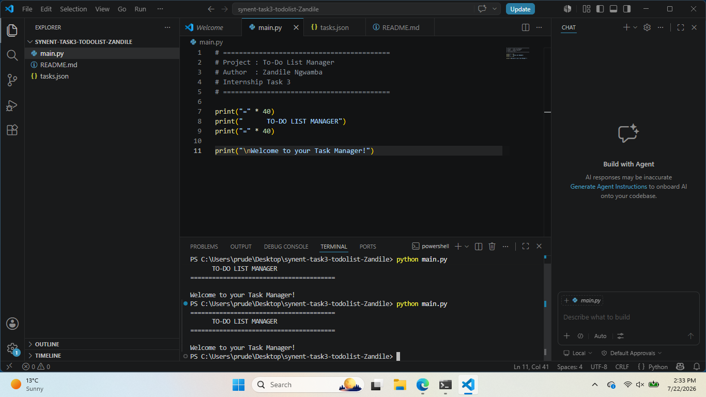
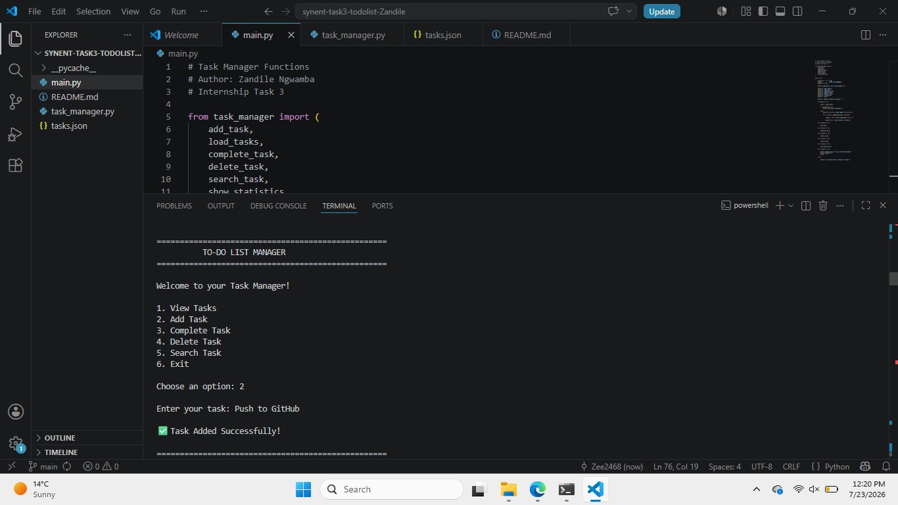
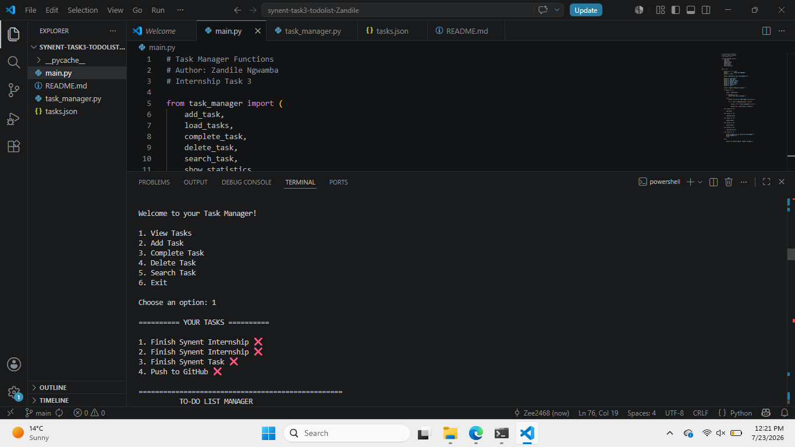
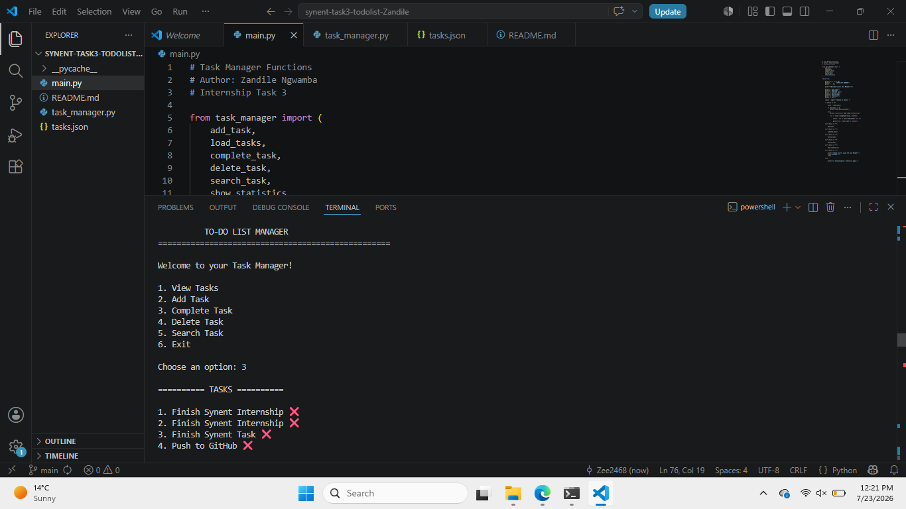
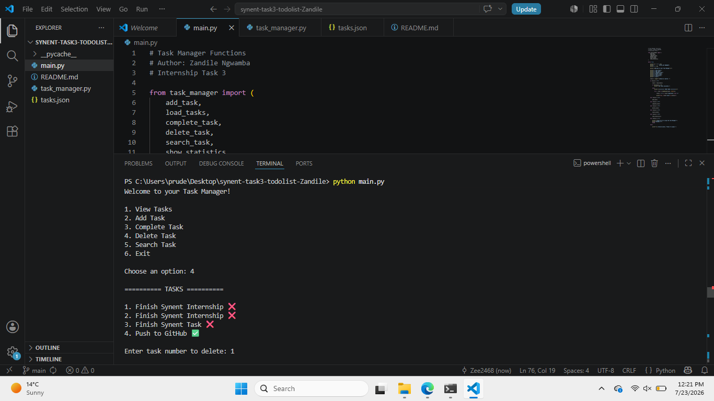
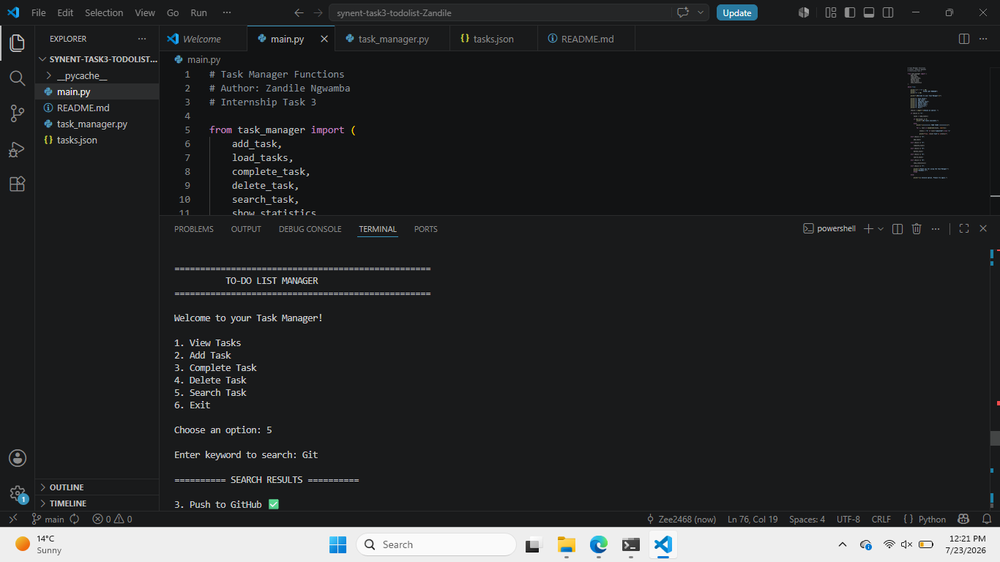
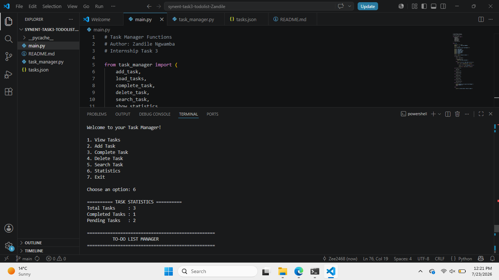

# To-Do List Manager

## Internship Task 3

**Author:** Ngwamba Zandile Prudence

---

## Description

A command-line **To-Do List Manager** developed in Python for the **Synent Technologies Python Development Internship (Task 3).**

This application enables users to efficiently manage their daily tasks through a simple, menu-driven interface. Tasks are stored permanently in a JSON file, allowing users to save and retrieve their tasks even after closing the application.

---

## Objective

The objective of this project is to demonstrate Python programming fundamentals, file handling using JSON, and CRUD (Create, Read, Update, Delete) operations through a practical command-line application.

---

## Requirements

- Python 3.x
- Visual Studio Code (Recommended)
- Git (Optional, for cloning the repository)

---

## Features

- View Tasks
- Add New Tasks
- Mark Tasks as Completed
- Delete Tasks
- Search Tasks
- View Task Statistics
- Store Tasks Using JSON

---

## Technologies Used

- Python 3
- JSON (Data Storage)

---

## How to Run

### 1. Clone the repository

```bash
git clone https://github.com/Zee2468/synent-task3-todolist-ZandileNgwamba.git
```

### 2. Navigate to the project folder

```bash
cd synent-task3-todolist-ZandileNgwamba
```

### 3. Run the application

```bash
python main.py
```

---

## Project Structure

```text
synent-task3-todolist-ZandileNgwamba/
│
├── main.py
├── task_manager.py
├── tasks.json
├── README.md
└── Screenshots/
    ├── main-menu.png
    ├── add-task.png
    ├── view-tasks.png
    ├── complete-task.png
    ├── delete-task.png
    ├── search-task.png
    ├── statistics.png
    └── exit.png
```

---

## Screenshots

### Main Menu



---

### Add Task



---

### View Tasks



---

### Complete Task



---

### Delete Task



---

### Search Task



---

### Statistics Dashboard



---

### Exit Application


---

## Future Improvements

- Edit existing tasks
- Add task priorities
- Add due dates
- Sort tasks alphabetically
- Export tasks to CSV
- Build a graphical user interface (GUI)
- Add cloud storage support

---

## Author

**Ngwamba Zandile Prudence**

 **Email:** prudencezandile77@gmail.com

 **LinkedIn:** https://www.linkedin.com/in/zandile-prudence-441209333

 **GitHub:** https://github.com/Zee2468

---

##  Internship Information

**Company:** Synent Technologies

**Internship:** Python Development Internship Program

**Task:** Task 3 – To-Do List Manager (CLI)

---

##  License

This project was created for educational purposes as part of the **Synent Technologies Python Development Internship**.

---

⭐ If you found this project helpful, feel free to star this repository.